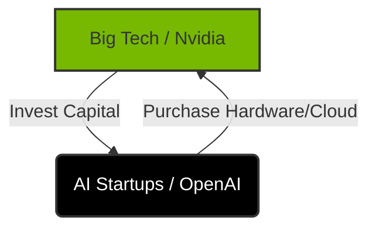

  <h3>🚀 Executive Summary</h3>
  <ul>
    <li><strong>The Event:</strong> Reports surfaced that Nvidia's $100B investment in OpenAI stalled due to strategy disagreements.</li>
    <li><strong>The Pivot:</strong> Jensen Huang denied the "rift," calling it nonsense, but concerns over "circular financing" persist.</li>
    <li><strong>The Verdict:</strong> Expect deal completion, but scrutiny on AI revenue quality is increasing. Volatility ahead.</li>
  </ul>

## The $100 Billion Pause 🛑

Nvidia ( [$NVDA](https://www.tradingview.com/symbols/NVDA/) ) shares slipped 1.1% in early trading Monday following a startling report from the Wall Street Journal. The headline? The chipmaker’s massive $100 billion investment plan into OpenAI might be on hold.

The report cited sources claiming CEO Jensen Huang was critical of OpenAI’s "not finalized" deal structure and, more bitingly, a **"lack of discipline"** in their business strategy.

For a market pricing in perfection from the AI sector, any hint of friction between the King of Hardware (Nvidia) and the King of Software (OpenAI) is a major red flag.

## What Upset Jensen Huang? 🤨

According to the reports, Huang's private concerns centered on two main pillars:

1.  **Strategic Discipline**: A perception that OpenAI is expanding without sufficient operational efficiency.
2.  **Competitive Landscape**: OpenAI's increasing flirtation with rivals like Google ( [$GOOGL](https://www.tradingview.com/symbols/GOOGL/) ) and Anthropic.

Huang reportedly emphasized to associates that the $100 billion figure flaunted in September was **"nonbinding."** This walk-back spooked investors who viewed the capital injection as a done deal.

## Damage Control: "It's Nonsense" 🛡️

The denial was swift. Over the weekend, Huang moved to kill the narrative.

> "We are going to make a huge investment in OpenAI... I really love working with Sam [Altman]."

He labeled the idea of a rift as "nonsense" and reiterated that they would conduct "probably the largest investment we've ever made."

However, the rapid oscillation—from criticism to effusive praise—suggests a high-stakes negotiation is playing out in the public eye. It’s classic **power play**: threaten to walk away to secure better terms, then reassure the market to prevent a stock rout.

## The Real Risk: Circular Financing 🔄

Beyond the drama, there is a structural concern raised by Wedbush analyst Dan Ives: **Circular Financing**.

The market is waking up to the incestuous nature of AI capital flows.

When Nvidia invests billions into a company that immediately sends those billions back to Nvidia to buy H200s, is it genuine revenue or just accounting alchemy?

Ives notes that Huang’s tight negotiation style might be a way to prove that Nvidia isn’t just fueling its own competitors indiscriminately. It adds a layer of due diligence to the "AI Bubble" narrative.

## Verdict: Noise or Signal? ⚖️

So, how should we read this?

| Factor | Bull Case 🐂 | Bear Case 🐻 |
|--------|--------------|--------------|
| **The Rift** | Just negotiation tactics. Deal will close. | Fundamental misalignment on strategy. |
| **Financing** | Strategic partnership for future roadmap. | Artificial revenue inflation via circular capex. |
| **Stock Action** | Dip buying opportunity. | Warning sign of peak AI sentiment. |

**My Take**: The relationship is too symbiotic to fail. OpenAI needs chips; Nvidia needs a dominant software partner. This is likely **noise** in the grand scheme, but it serves as a healthy reminder: The checks are getting larger, and the scrutiny is getting tighter.

Expect the deal to close, but perhaps with more strings attached than Sam Altman originally hoped.

---

> ⚠️ **Disclaimer**: This content is for informational purposes only and does not constitute investment advice. Investment decisions should be made based on your own judgment and responsibility.

---
*Source: [CNBC](https://www.cnbc.com/2026/02/02/nvidia-stock-price-openai-funding.html)*